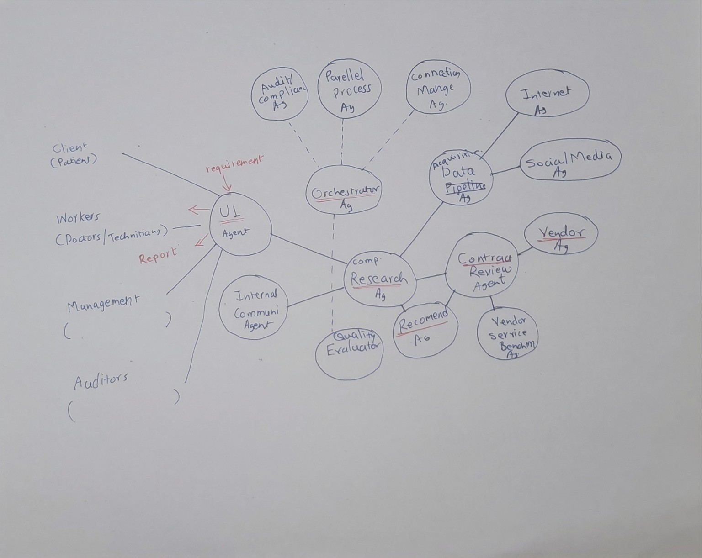

# High-Level Agent Architecture v3: PreMortem AI

## 1. Goal

PreMortem AI should evolve from a single MRI procurement demo into a **generic agentic business decision review framework**.

The MRI procurement scenario remains the first working demo, but the architecture should support other business workflows later, such as:

- Procurement approval
- Vendor evaluation
- Contract review
- Cost optimization
- Compliance review
- Continuous monitoring after approval

The broader goal is to show that PreMortem AI is not only a medical-equipment risk analyzer, but a reusable decision-review platform.

---

## Relationship Between PreMortem and Architecture

PreMortem is a workflow, not the architecture.

The current MRI procurement implementation should be viewed as the first workflow implemented on top of a generic Agentic Business Decision Review Platform.

Potential future workflows include:

- Procurement PreMortem
- Vendor Evaluation
- Contract Risk Assessment
- Compliance Audit
- Procurement Approval
- Vendor Selection
- Cost Optimization

## 2. Core Idea

PreMortem AI simulates a business review board before a high-risk decision is approved.

Instead of one model producing one answer, the system uses multiple agents that investigate different dimensions of the decision. The agents can run in parallel, return structured findings, and provide evidence to an orchestrator.

The orchestrator acts like a human manager:

- Receives the business request
- Decides which agents should participate
- Sends tasks to agents
- Waits for responses
- Consolidates findings
- Sends outputs to an evaluator
- Presents the final decision package to the UI

The current MRI workflow can be treated as the first specialized client workflow built on top of this generic architecture.

---

## 3. Architecture Principle

The architecture should separate:

1. **Generic Agentic Workflow**
   - Orchestration
   - Parallel execution
   - Evaluation
   - Decision summary
   - UI state tracking

2. **Domain-Specific Interfaces**
   - Procurement fields
   - MRI-specific checklist
   - Client-specific rules
   - Compliance requirements
   - Vendor-specific benchmarks

This separation makes the solution easier to customize for different clients and business workflows.

---

## Architecture Diagram



The diagram illustrates the long-term architecture vision.

The weekend implementation will focus on a subset of these components while preserving the overall architecture.

---

## 4. Generic Workflow

```text
Business Request
      ↓
UI Guidance Agent / Intake Assistant
      ↓
Customer / Requirement Intake Agent
      ↓
Orchestrator / Manager Agent
      ↓
Parallel Execution Layer
      ↓
Specialist Agents
      ↓
Evaluator Agent
      ↓
Decision Summary Agent
      ↓
UI Dashboard / Human Review
```

The orchestrator owns the workflow. The parallel execution layer is an implementation mechanism that helps scale agent calls and prevent blocking.

RAG opportunity: CSV/JSON files and run artifacts are sufficient for the demo, while future RAG can improve retrieval of prior decisions, vendor history, policy knowledge, reviewer feedback, and chatbot guidance.

For production-style robustness, the execution layer can later support:

- Timeouts
- Retries
- Circuit breakers
- Partial results
- Cost controls
- Agent failure handling

---

## 5. Main Components

### 5.1 Workflow Input Layer

The workflow input layer accepts the business decision request.

For the current demo, the input is MRI procurement data.

Later, the same design can support:

- Vendor onboarding
- Contract approval
- Cost benchmarking
- Sourcing decision review
- Compliance audit
- Post-approval monitoring

The input layer should eventually support:

- Forms
- Uploaded documents
- Structured procurement data
- Emails or communication extracts
- External system inputs

---

### 5.2 UI Guidance Agent

The UI Guidance Agent is an optional agent-assisted UI layer. It should help the user move through the workflow, but it should not own core storage, orchestration, or final decision logic.

This agent is different from the Streamlit UI itself. The UI remains a deterministic application surface, while the UI Guidance Agent helps users understand what to do next.

Responsibilities:

- Explain the current screen and next action.
- Help the user create a bid or request-for-quote.
- Suggest missing bid details or quote-upload requirements.
- Recommend decision criteria templates.
- Summarize agent status and run progress in plain business language.
- Explain bid results and why a quote won or lost.
- Help the user drill down from bid-level results into quote-level analysis.
- Ask clarifying questions when the input is incomplete.

The UI Guidance Agent should not:

- Save files directly.
- Modify `bids_database.csv` or output artifacts directly.
- Bypass the orchestrator.
- Make final procurement decisions independently.
- Dynamically generate arbitrary UI code.

For the first implementation, this can remain a future component. The practical UI should still use deterministic screens for bid intake, quote uploads, run monitoring, results, and quote detail.

---

### 5.3 Customer / Requirement Intake Agent

This agent captures and clarifies the business requirement.

Responsibilities:

- Understand the business decision being reviewed
- Identify missing input fields
- Convert unstructured input into structured workflow data
- Ask clarifying questions where required
- Select the appropriate workflow template

For the weekend demo, this can remain simple or partially mocked.

---

### 5.4 Orchestrator / Manager Agent

The orchestrator is the central controller of the workflow.

Responsibilities:

- Receive structured business input
- Select the workflow template
- Decide which agents should run
- Pass relevant data to each agent
- Trigger parallel execution where possible
- Wait for responses
- Handle missing or failed agent outputs
- Send consolidated agent outputs to the evaluator
- Prepare the final decision package for the UI

The orchestrator should behave like a human manager assigning work to specialists.

For the next implementation step, the orchestrator can be a lightweight controller that calls existing agents and returns structured intermediate states to the UI.

---

### 5.5 Parallel Execution Layer

This is not a business agent. It is a system layer used by the orchestrator.

Responsibilities:

- Run independent agent calls in parallel
- Track agent status
- Handle timeouts
- Support retries
- Return partial results if some agents fail
- Prevent one slow agent from blocking the full workflow

This layer helps justify the use of Agentic AI because the system is not just a single sequential LLM call.

---

### 5.6 Specialist Agents

Specialist agents should be generic enough to support multiple business workflows, while still allowing domain-specific adapters.

#### Minimal Specialist Agents for Demo

##### 1. Contract / Terms Agent
Contract Review Agent

The current PreMortem implementation can evolve into this component.

Responsibilities:

- Contract analysis
- Clause extraction
- Warranty review
- Payment milestone review
- Installation responsibility review
- Commercial risk assessment
- Contract-submission quality review
- Identification of missing, vague, conflicting, extra, or unusual contract terms
- Assessment of whether contract and commercial claims are evidence-backed
- Detection of proposal language that is mostly marketing rather than operationally specific
- Identification of vendor differentiators that affect contract execution risk
- Follow-up questions needed before award or negotiation

The Contract Review Agent should analyze the vendor submission, not only fixed procurement fields. When raw quote text is available, it should treat the raw document text as the primary source and use fixed fields only as context or fallback.

Contract Review Agent should explicitly capture:

- What the vendor emphasizes in the contract/commercial submission.
- What the vendor avoids saying or leaves unclear.
- How specific the implementation, installation, warranty, service, and training commitments are.
- Whether important claims are supported by evidence in the document.
- Whether the quote is substance-heavy, marketing-heavy, or mixed.
- Unusual conditions, exceptions, exclusions, or commercial terms.
- Differentiators that reduce or increase contract execution risk.
- Whether the proposal appears mature, vague, incomplete, or risky.
- Follow-up questions required before a final procurement decision.

If fixed fields conflict with raw quote text, the agent should report the conflict instead of silently choosing one source.


##### 2. Cost / Benchmark Agent

Checks:

- Quoted cost against historical purchases
- Vendor price against benchmark ranges
- Cost-to-value justification
- Possible overpricing or rate inflation

This should eventually support supplier value-to-cost benchmarking, not only lowest-price comparison.

##### 3. Operational Readiness Agent

Checks whether the business is ready to execute the decision after approval.

For MRI procurement, this includes:

- Site readiness
- Electrical readiness
- Regulatory approvals
- Technician availability
- Training readiness

This agent can also support checklist generation and procedure updates.

##### 4. Vendor / Proposal Understanding and External Risk Agent

This agent owns vendor and proposal understanding. It should extract information from the vendor quote document and produce a reusable schema that can be passed to Contract Review, Cost Benchmark, Compliance, Vendor Risk, Bid Recommendation, and Evaluator agents.

The agent should not only parse fixed fields. It should preserve proposal-level intelligence that a human reviewer would use when judging vendor submissions.

Document extraction responsibilities:

- Read raw extracted text from vendor quote PDFs.
- Extract core comparable fields where possible.
- Capture vendor profile information, references, certifications, service claims, and differentiators.
- Capture what the vendor emphasizes.
- Capture what the vendor omits, avoids, or leaves vague.
- Identify extra information that may be useful for evaluation.
- Identify unusual claims, unusual terms, exceptions, or conditions.
- Assess evidence quality and specificity.
- Separate explicitly stated facts from inferred or unclear information.
- Attach evidence snippets to extracted fields and observations.
- Produce follow-up questions for missing or ambiguous proposal information.

The first implementation should use a deterministic document parser before the Vendor / Proposal Understanding Agent:

```text
PDF bytes
  -> deterministic parser extracts text
  -> Vendor / Proposal Understanding Agent interprets the extracted text
```

This is preferred for the demo because it is faster, cheaper, easier to debug, and produces auditable text that can be reused by multiple agents. The Vendor Agent should focus on interpretation and proposal intelligence, not low-level PDF byte parsing.

If deterministic extraction quality is poor, the system can later fall back to a document-capable LLM, OCR, or vision-based extraction path. This may improve accuracy for scanned PDFs, complex tables, multi-column layouts, stamps, signatures, or image-heavy quote documents.

The proposal artifact should therefore track extraction metadata such as:

- extraction method
- text character count
- text preview
- extraction quality
- whether OCR or vision fallback is needed

Current implementation status:

- Deterministic PDF text extraction exists.
- Vendor / Proposal Understanding Agent is designed but not implemented yet.
- Until the Vendor Agent is implemented, the Contract Review Agent reads `raw_document_text` directly.

External/vendor-risk responsibilities:

- Vendor performance
- Delivery history
- Reputation
- Litigation or dispute indicators
- External risk signals

This is related to competitor/vendor research, but should be framed more broadly as external risk intelligence.

Output should include both:

1. Comparable structured fields for fair quote comparison.
2. Open proposal observations that preserve vendor-specific richness.

The Vendor / Proposal Understanding and External Risk Agent should not make the final quote recommendation. It prepares structured, evidence-backed inputs for downstream specialist agents and the Bid Recommendation Agent.

##### 5. Internet / Market Research Agent

The Internet / Market Research Agent should move from a future extension to a
near-term agent because the Bid Recommendation Agent needs current market and
specification context to compare vendor quotes fairly.

This agent should be implemented first with OpenAI Responses API `web_search`.
It is an LLM-backed agentic web research service: the model uses the web search
tool, interprets retrieved information, and returns structured benchmark
signals. It is not a deterministic search program.

Primary responsibilities:

- Search current market/specification context for the procurement category.
- Identify expected market price ranges when reliable public information exists.
- Identify typical delivery timelines.
- Identify typical advance payment, retention, and milestone-payment practices.
- Identify typical warranty-start triggers.
- Identify installation, commissioning, and acceptance responsibility norms.
- Identify whether training is normally included.
- Identify common service SLA expectations such as response, resolution, spare
  parts, preventive maintenance, uptime, remedies, and exclusions.
- Identify consumables, recurring supplies, software subscriptions, service
  kits, spare parts, and lifecycle-cost dependencies where relevant.
- Identify current market facts, supply constraints, technology lifecycle
  changes, or future trends that may not be present in the base LLM model.
- Identify relevant regulatory, certification, or compliance expectations.
- Identify public vendor/product reputation signals, adverse news, debarment, or
  dispute indicators when available.

This agent should return structured, source-aware output, not raw web pages.
Every benchmark claim should include source URLs and retrieval timestamp where
possible. If source quality is weak or market data is unavailable, the agent
should state limitations instead of inventing values.

Expected artifact:

```text
artifact_market_research
```

Suggested output shape:

```json
{
  "provider": "openai_web_search",
  "retrieved_at": "...",
  "equipment_type": "...",
  "market_price_range": {
    "summary": "...",
    "confidence": "low|medium|high",
    "sources": ["..."]
  },
  "typical_terms": {
    "delivery_timeline": "...",
    "advance_payment": "...",
    "warranty_start": "...",
    "installation": "...",
    "training": "...",
    "service_sla": "..."
  },
  "consumables_and_lifecycle_costs": {
    "summary": "...",
    "known_consumables": ["..."],
    "recurring_cost_risks": ["..."],
    "sources": ["..."],
    "confidence": "low|medium|high"
  },
  "current_market_or_future_trends": {
    "summary": "...",
    "signals": ["..."],
    "sources": ["..."],
    "confidence": "low|medium|high"
  },
  "red_flags": ["..."],
  "limitations": ["..."]
}
```

Guardrails:

- Use current quote and bid requirements as primary evidence.
- Treat internet research as benchmark context, not proof that a quote is good
  or bad.
- Do not override hard blockers from contract review, compliance, or management
  criteria.
- Store research output as a run artifact so the recommender and auditors can
  see what external context was used.
- Keep provider logic in a backend service such as
  `backend/app/services/market_research.py`, so a future MCP provider can
  replace OpenAI web search without changing the recommender interface.

##### 6. Compliance / Policy Agent

Checks:

- Internal policy compliance
- Audit readiness
- Regulatory requirements
- Restricted-domain requirements
- Privacy or governance requirements

This may be important for government, restricted-domain, or enterprise procurement use cases.

##### 7. Bid Recommendation Agent

The Bid Recommendation Agent is the decision integrator for a bidding process. It compares multiple vendor quotes within one bid and recommends the best quote or shortlist.

This agent should not perform every analysis itself. It should consume structured outputs from specialist agents and external-signal agents, then synthesize a final ranking.

Current demo inputs:

- Quote PDFs and extracted quote text.
- Vendor / Proposal Understanding and External Risk Agent outputs when available.
- Contract Review Agent outputs.
- Dataset metadata such as weighted decision score, rank, and ground-truth labels for evaluation.
- Management criteria and weights where available.

Future inputs:

- Cost / Benchmark Agent outputs.
- Compliance / Policy Agent outputs.
- Vendor / External Risk Agent outputs.
- Internet / Market Research Agent outputs.
- MCP-based external research outputs for current market/specification checks.
- Historical procurement examples.
- Human reviewer comments or overrides.

Expected output:

- Winning quote.
- Ranked quote list.
- Top 2 / top 3 / top 5 shortlist.
- Selection rationale.
- Rejection or downgrade reasons for weaker quotes.
- Negotiation points.
- Risks that require human review.
- Confidence score.

The Bid Recommendation Agent is different from the Decision Summary Agent:

- Bid Recommendation Agent decides which quote is best within a bid.
- Decision Summary Agent converts evaluator-approved results into a business-friendly report and approval package.

The first implementation can use a simple ranking strategy based on Contract Review Agent outputs and dataset metadata. Later, the same agent input schema can accept internet, vendor, benchmark, compliance, and historical signals without changing the UI or graph API contract.

MCP and internet-based research should be treated as an external signal layer,
not as the recommender's core decision logic. The Bid Recommendation Agent can
ask a Market Intelligence or MCP Research tool for structured signals such as:

- Current market price range for the equipment or service.
- Typical delivery timelines.
- Typical advance payment and retention practices.
- Common warranty-start trigger, such as delivery, installation, commissioning,
  or acceptance.
- Expected installation and commissioning responsibility.
- Typical training inclusion.
- Common service SLA terms such as response time, resolution time, spare parts,
  uptime, preventive maintenance, and remedies.
- Regulatory or certification expectations.
- Vendor/product reputation signals and public adverse-news/debarment signals
  where available.
- Comparable procurement examples.

The output of this research layer should be structured and source-aware, for
example:

```json
{
  "market_price_range": "...",
  "typical_delivery_timeline": "...",
  "typical_warranty_start": "...",
  "typical_training_expectation": "...",
  "source_urls": ["..."],
  "retrieved_at": "..."
}
```

The recommender should compare these external signals against each quote, but
it should keep current quote evidence separate from internet evidence. Internet
research can highlight unusual terms or missing information, but it should not
override hard blockers from contract review, compliance, or current bid
requirements. For repeatability, the research result should be stored as a run
artifact and later as decision-history context.

First implementation recommendation: use OpenAI's Responses API `web_search`
tool as the market/specification research provider. This is simpler than
running a separate MCP server and is enough for the first demo version.

```text
Bid Recommender Agent
  -> Market Research Service
      -> OpenAI Responses API with web_search
      -> structured market/specification benchmark JSON
      -> artifact_market_research
  -> deterministic ranking and guardrails
  -> optional LLM explanation
```

The Market Research Service should live in a backend service module rather than
inside the recommender agent directly, for example:

```text
backend/app/services/market_research.py
```

The service should accept a compact query object:

```json
{
  "bid_id": "BID-001",
  "equipment_type": "MRI Machine",
  "procurement_name": "MRI Machine Procurement",
  "quote_summaries": [
    {
      "quote_id": "BID-001-Q01",
      "vendor_name": "...",
      "quoted_amount": "...",
      "delivery_timeline": "...",
      "warranty_start": "...",
      "training_included": false,
      "service_terms": "..."
    }
  ]
}
```

And return a bounded, source-aware benchmark object:

```json
{
  "provider": "openai_web_search",
  "retrieved_at": "...",
  "equipment_type": "MRI Machine",
  "market_price_range": {
    "summary": "...",
    "confidence": "low|medium|high",
    "sources": ["..."]
  },
  "typical_terms": {
    "delivery_timeline": "...",
    "advance_payment": "...",
    "warranty_start": "...",
    "training": "...",
    "service_sla": "..."
  },
  "red_flags": [
    "..."
  ],
  "limitations": [
    "..."
  ]
}
```

Guardrails for this service:

- Use web search only when `MARKET_RESEARCH_ENABLED=1`.
- Keep API/provider logic centralized in the backend service.
- Return an empty or offline result when no API key is configured.
- Store the result as a run artifact for repeatability.
- Include source URLs and retrieval timestamp for every benchmark claim where
  possible.
- Do not pass raw web pages directly to the recommender.
- Do not let market research override hard blockers from current quote evidence.

Future implementation: replace or augment `market_research.py` with an MCP
provider. The recommender should not care whether the benchmark came from
OpenAI `web_search`, AWS MCP search, or a custom MCP server as long as the
service returns the same structured benchmark schema.

---

### 5.7 Evaluator Agent

The evaluator reviews the overall quality of the workflow.

Responsibilities:

- Check whether all required agents completed
- Check if findings are consistent
- Identify missing evidence
- Identify conflicting recommendations
- Evaluate whether conclusions are supported by data
- Estimate confidence
- Flag weak or cosmetic outputs
- Decide whether the final report is ready for human review

This is important because the system should not only generate content; it should also monitor the quality and reliability of its own workflow.

---

### 5.8 Decision Summary Agent

The Decision Summary Agent converts the evaluator-approved outputs into a business-friendly decision package.

Final output should include:

- Go / No-Go / Conditional Go
- Overall risk score
- Key risks
- Supporting evidence
- Missing information
- Recommended next actions
- Agent-level status
- Confidence score
- Approval conditions
- Follow-up tasks

---

### 5.9 UI Dashboard

The UI should show the agentic workflow, not just the final answer.

Suggested UI sections:

- Business input summary
- Workflow selected
- Orchestrator status
- Agent execution cards
- Agent findings
- Evaluator feedback
- Final decision
- Risk score and confidence
- Recommended actions
- Future workflow placeholders

The UI Guidance Agent can sit alongside this dashboard later as an assistant that explains what the dashboard means and recommends the next user action. The dashboard itself should remain deterministic and backed by orchestrator state and output artifacts.

Even if not all workflows are implemented, the UI can show the intended expandable architecture.

---

## 6. Memory Architecture

The agent platform should separate memory into three layers. This prevents the agents from mixing stable operating knowledge, temporary case context, and long-term decision history.

The three memory layers are:

1. **Long-term agent memory**
   - Stable knowledge that defines how an agent behaves.
   - Stored as human-readable Markdown files using an OKF-style knowledge structure.
   - Version-controlled, curated, and easy for the team to inspect.
   - Loaded selectively into prompts rather than sending every knowledge file every time.

2. **Short-term working memory**
   - Temporary context for the current review or recent decision window.
   - Includes current procurement inputs, uploaded document excerpts, intermediate findings, and relevant retrieved snippets.
   - Can use vector search or a cache-like retrieval layer when the system needs to find relevant context within a bounded range.
   - Should stay small so older decisions do not over-influence the current review.

3. **Decision history**
   - Long-term record of prior reviews, outcomes, risk scores, evidence, human decisions, and later actual results.
   - Stored in a database or vector-enabled store, but not automatically injected into every agent prompt.
   - Used like a database plus cache: searchable when needed, but not always present in the agent's working context.
   - Supports audit, analytics, similarity search, and later learning loops.

### 6.1 Long-Term Memory Using OKF-Style Markdown

The long-term memory should be the agent's stable operating manual. For the Contract Review Agent, this can start with a file such as:

```text
backend/app/knowledge/
  contract_agent/
    contract_agent_profile.md
    risk_rubric.md
    bias_controls.md
    clause_guidance.md
    red_flags/
      scope_ambiguity.md
      weak_penalty_clause.md
      vendor_lockin.md
      unclear_acceptance.md
      single_bid.md
    sectors/
      medical_equipment.md
      construction.md
      software.md
```

The core files are always useful for the Contract Review Agent:

- `contract_agent_profile.md`
- `risk_rubric.md`
- `bias_controls.md`

Topic-specific files should be loaded only when relevant to the current case. For example, an MRI procurement with installation, calibration, warranty, and training obligations may load:

- `sectors/medical_equipment.md`
- `red_flags/unclear_acceptance.md`
- `red_flags/weak_penalty_clause.md`
- `red_flags/vendor_lockin.md`

The Markdown files can include simple metadata to support retrieval:

```md
---
agent: contract
topics: [medical_equipment, installation, calibration, warranty]
triggers: [MRI, medical equipment, calibration, installation, training, warranty]
priority: high
---

# Medical Equipment Contract Risks

Review whether installation, calibration, acceptance testing, warranty, service response, and training responsibilities are explicitly assigned.
```

The Contract Review Agent does not automatically receive the entire knowledge folder. The system should load core memory plus a small number of relevant topic files.

#### Current Implementation Note: Single-Pass OKF Memory Prompt

The current backend implementation is an early version of this memory design.
It uses `OKF_MEMORY_ROOT` to point the Contract Review Agent at the OKF-style
profile folder under:

```text
backend/agent_profiles/contract_agent_profile/
```

At startup, the backend loads a compact bundle from:

```text
index.md
profile.md
policies/*.md
patterns/*.md
```

That bundle is appended to the base contract-agent prompt before the LLM call.
The resulting flow is currently:

```text
base contract prompt
  + loaded OKF profile/policy/pattern bundle
  + current procurement or quote text
  -> Contract Review Agent result
```

This means the OKF `index.md` gives the model guidance about how to use memory,
but the code does not yet perform clause-level filtering before prompt
construction. The LLM receives the loaded bundle and chooses which guidance is
relevant while producing the final answer.

This is better described as a **single-pass OKF memory prompt**, not as
one-shot prompting. One-shot and few-shot prompting refer to how many examples
are included in a prompt. Here, single-pass means the backend sends one final
analysis prompt instead of first running a separate memory-selection step.

TODO: investigate how OKF memory filtering should happen before prompt
construction. Candidate approaches:

- Rule-based selector using metadata, triggers, and keywords.
- Vector selector using Chroma or pgvector to retrieve relevant OKF chunks.
- Two-step selector where the model first reads the OKF index/frontmatter and
  returns selected memory paths as structured JSON, then the orchestrator builds
  a refined prompt from only those files.
- Hybrid selector that uses rules or vector retrieval to shortlist memory and a
  model or deterministic reranker to validate the final selection.

#### Incremental Storage Plan

The OKF Markdown folder remains the source of truth. The first implementation
does not need a vector database or one JSON file per agent. Instead, the backend
can parse OKF files into JSON-like chunk objects in memory at startup:

```json
{
  "agent_id": "contract_agent",
  "source_path": "policies/warranty.md",
  "memory_type": "policy",
  "tags": ["warranty", "commissioning"],
  "content": "Plain-text OKF clause or section..."
}
```

The selector can filter these in-memory chunks by `agent_id`, path, tags,
triggers, and keyword matches. The selected `content` is then inserted into the
LLM prompt as plain text.

If debugging or inspection is needed, the backend may generate a local index
file such as:

```text
backend/agent_profiles/contract_agent_profile/contract_agent_memory_index.json
```

This file should contain parsed metadata and plain-text chunks, not embeddings.
It should not be called `vectors.json` until real embedding vectors are stored.

When vector retrieval is added later, use one shared pgvector-enabled Postgres
database rather than one vector database per agent. Agent separation should be
handled with an `agent_id` or namespace column:

```sql
CREATE TABLE agent_memory_chunks (
  id text PRIMARY KEY,
  agent_id text NOT NULL,
  source_path text NOT NULL,
  memory_type text NOT NULL,
  tags jsonb,
  content text NOT NULL,
  embedding vector(384)
);
```

Each agent retrieves only its own memory:

```sql
SELECT *
FROM agent_memory_chunks
WHERE agent_id = 'contract_agent'
ORDER BY embedding <-> :query_embedding
LIMIT 5;
```

This keeps the architecture modular while avoiding separate storage systems for
each agent.

Current pgvector implementation note: the first pgvector version can use a
small deterministic local feature vector to wire the storage and retrieval flow
without a paid embedding API or new ML dependency. This proves the architecture:

```text
OKF Markdown
  -> parsed memory chunks
  -> local feature vector
  -> shared pgvector table
  -> retrieved plain-text chunks
  -> LLM prompt
```

Later, replace the temporary local feature vector with a stronger local
embedding model such as SentenceTransformers, while keeping the same table and
retrieval interface.

Implementation details for the current version:

- Indexed data: OKF agent memory only. Bid/run history is not written to
  pgvector yet.
- Chunking strategy: one OKF Markdown file becomes one vector chunk.
- Embedding method: `local_hashing_vector_v1`, a deterministic 32-dimensional
  local feature vector.
- Normalization: L2 normalization is applied so longer files do not dominate
  similarity only because they contain more tokens.
- Retrieval output: pgvector is used to choose relevant chunks, but the LLM
  still receives the selected plain-text OKF content, not the numeric vectors.
- Upgrade path: replace the temporary local hashing vector with a local semantic
  embedding model and optionally split larger Markdown files by heading or
  section.

### 6.2 Contract Review Agent Memory Example

For the Contract Review Agent, long-term memory should contain:

- Agent role and boundaries.
- Expected inputs and outputs.
- Risk scoring rubric.
- Contract red flags.
- Clause review guidance.
- Bias controls.
- Curated lessons from reviewed historical cases.

Example content for `contract_agent_profile.md`:

```md
# Contract Risk Agent Profile

## Role
Assess contract-related procurement failure risk before approval.

## Inputs
Use procurement description, budget, timeline, vendor details, uploaded contract or quote text, and relevant outputs from other agents.

## Outputs
Return risk score, findings, reasoning, evidence references, mitigation suggestions, follow-up questions, and confidence.

## Boundaries
Do not make legal conclusions. Identify procurement execution risk.
Do not assess infrastructure readiness unless contract terms directly affect it.
Do not treat missing information as proof of failure.

## Bias Controls
Do not penalize large projects only because they are large.
Do not assume a new vendor is weak without evidence.
Do not copy risk scores from historical examples.
Separate probability of failure from financial exposure.
```

The prompt should then be assembled from selected memory:

```text
SYSTEM:
You are the Contract Review Agent.

CORE MEMORY:
[contract_agent_profile.md]
[risk_rubric.md]
[bias_controls.md]

RELEVANT MEMORY:
[medical_equipment.md]
[weak_penalty_clause.md]
[unclear_acceptance.md]

CURRENT CASE:
[procurement input + extracted document text + relevant other-agent findings]

TASK:
Analyze contract-related risks and return structured AgentResult JSON.
```

### 6.3 Short-Term Working Memory

Short-term memory should represent the current case and a bounded recent context window. It should include:

- Current procurement input.
- Raw extracted document text or selected excerpts.
- Intermediate observations from the current run.
- Other specialist agent outputs needed by the Contract Review Agent.
- Relevant retrieved snippets from a recent range or cache.
- Missing information and follow-up questions.

This memory should be intentionally small. Old decisions should not directly influence every new review. Instead, recent or similar cases can be retrieved only when the retriever decides they are relevant.

Vector search can be useful for short-term or range-bounded retrieval when the question is semantic, such as:

```text
Find recent contract reviews with similar vague installation responsibility.
```

Text search can be better for exact needles, such as:

```text
Find cases mentioning "liquidated damages" or "single bid".
```

The practical design can use hybrid retrieval:

```text
Current case
  -> keyword filters and metadata filters
  -> optional vector similarity over bounded recent cases
  -> selected snippets
  -> agent prompt
```

### 6.4 Decision History

Decision history is not the same as prompt memory. It should be treated as a long-term evidence store.

Decision history should capture enough information to explain and replay why a
recommendation was made. It should store both the static inputs provided by the
user and the learned or retrieved context that influenced the decision.

The decision snapshot should include:

- Case ID, run ID, date, and time.
- Static procurement input: title, category, department, location, budget,
  timeline, equipment or service type, project criticality, site readiness,
  workforce readiness, regulatory requirements, and raw form fields.
- Vendor and quote inputs: quote ID, vendor name, quoted amount, advance
  payment, delivery timeline, warranty start, installation responsibility,
  training commitment, service response terms, local service availability, and
  source document metadata.
- Extracted document text, selected excerpts, or durable document references.
- Static evaluation parameters: criteria version, rubric version, risk
  thresholds, scoring weights, agent/profile version, prompt version, and memory
  version where available.
- Learned or retrieved context: OKF memory chunks retrieved, historical examples
  used, future decision-history chunks retrieved, similarity scores, retrieval
  metadata, and any reviewer preference or policy override used later.
- Specialist agent outputs: contract risk, infrastructure readiness, workforce
  readiness, historical intelligence, financial exposure, decision board,
  debate turns, and scenario simulations.
- Final decision: selected quote or vendor, risk score, risk level,
  recommendation, findings, rationale, conditions before award, and
  approve/revise/reject status if the workflow captures it.
- Human decision or override.
- Actual outcome when known.
- Delay, failure, or success labels.
- Audit metadata: model/provider used, offline fallback status, app or git
  version if available, and whether LLM calls succeeded.

The vector-search layer should store a compact text representation of the
decision rather than only the final recommendation. For example, one completed
review may produce several `decision_history_chunks` rows:

- Procurement summary.
- Winning decision summary.
- Risk findings summary.
- Vendor or quote summary.
- Outcome summary when the real-world result is known.

Keep these rows separate from `agent_memory_chunks`. Agent memory is stable
guidance about how the agent should think; decision history is evidence about
what happened in previous cases.

This can be stored in a database or vector-enabled store. The important rule is that the agent should not access all decision history all the time. It should query decision history only when needed, similar to how an application uses a database and cache.

For example:

```text
Decision history database
  -> bounded recent history, such as last 10 completed decisions
  -> same-vendor history, such as last 5 decisions for the same vendor
  -> same-category history, such as last 5 decisions for the same equipment type
  -> vector search over decision_history_chunks for similar risk patterns
  -> compact relevant cases only
  -> selected evidence snippets passed to the agent
```

The prompt-size limit should be a final formatting guard, not the retrieval
strategy. Important factors should be selected first through metadata filters
and pgvector similarity. The current implementation uses a hybrid selector:
recent global decisions, same-vendor decisions, same-category decisions, and
vector-similar risk-pattern chunks.

This design preserves auditability and avoids noisy historical decisions polluting current reasoning.

### 6.5 Bid Recommendation Agent Memory

The Bid Recommendation Agent needs a different memory design from the Contract
Review Agent. The Contract Review Agent uses memory to spot contract-risk
patterns within one quote. The Bid Recommendation Agent should use memory to
compare multiple quotes, vendors, and tradeoffs within one bid.

The recommender should have three memory inputs:

1. **Short-term bid memory**
   - Current bid ID.
   - All quote IDs included in the run.
   - Vendor proposal artifacts.
   - Contract Review Agent outputs for each quote.
   - Future cost, compliance, vendor-risk, market-research, and evaluator
     outputs.
   - Management criteria and weights where available.

2. **Decision-history memory**
   - Prior winning quote patterns.
   - Prior shortlist patterns.
   - Same-vendor outcomes and repeated vendor issues.
   - Same-category quote comparisons.
   - Reviewer overrides and human feedback when available.
   - Similar bid outcomes retrieved from `decision_history` and
     `decision_history_chunks`.

3. **External market/specification memory**
   - MCP or internet research results stored as structured run artifacts.
   - Market price ranges.
   - Typical delivery, warranty, training, service, and payment practices.
   - Relevant regulatory or certification expectations.
   - Source URLs, retrieval timestamp, and confidence/quality notes.
   - Enabled explicitly with a setting such as `MARKET_RESEARCH_ENABLED=1`.

The recommender should not directly consume unbounded raw history or raw web
pages. It should receive compact, structured comparison signals. A future
retrieval policy can combine:

```text
Current bid quote reviews
  + minimum management criteria
  + management criteria weights
  + same-vendor decision history
  + same-category decision history
  + vector-similar prior bid outcomes
  + source-aware market/specification benchmarks
  -> deterministic ranking and guardrails
  -> optional LLM explanation
```

The deterministic ranking should remain separate from the optional LLM
explanation. The LLM may improve rationale, feedback, and negotiation language,
but it should not silently change the winner, shortlist, or score components.

Minimum qualification criteria should be checked before ranking. Initially,
these criteria should come from management or bid setup: mandatory
specifications, budget ceiling, delivery deadline, warranty/service
requirements, installation/commissioning responsibilities, training, local
support, and required certifications. Later, internet or MCP research can
augment these criteria with current market ranges and future trends, but it
should not replace management's stated decision priorities.

Cutoffs should be modeled inside ranking rather than as a single automatic
reject rule. Some cutoff failures are hard blockers, such as legal,
regulatory, safety, certification, or mandatory eligibility failures. Other
below-cutoff features may be negotiable gaps, such as high advance payment,
unclear warranty trigger, missing training, incomplete SLA, or unclear
installation responsibility. A quote with negotiable gaps can remain in a
shortlist if it is otherwise strong, but the recommender must mark it as
`shortlist with conditions`, list the required negotiation fixes, and route it
for human review when needed.

Current implementation note: the Bid Recommender Agent now has an OKF-style
profile under:

```text
backend/agent_profiles/bid_recommender_agent_profile/
```

This memory contains ranking, guardrail, external-signal, and tie-breaker
guidance. In the current implementation, it is loaded only into the optional LLM
explanation path. The deterministic ranking still uses explicit code and should
remain stable across runs.

### 6.6 Learning Loop

Short-term decisions and decision history can produce learning, but the system should not automatically rewrite long-term memory after every case.

Recommended learning loop:

```text
Decision history
  -> periodic review of repeated patterns
  -> human-approved lesson
  -> update OKF-style Markdown long-term memory
  -> version the memory update
```

Example:

```text
Pattern:
Several medical equipment procurements were delayed because installation, calibration, and training responsibility were unclear.

Approved long-term lesson:
For medical equipment contracts, explicitly review installation readiness, calibration ownership, acceptance testing, service response time, and training obligations.
```

This lesson can then be added to `sectors/medical_equipment.md` or `curated_lessons.md`.

### 6.7 Implementation Decision

For the next implementation, the architecture should use:

- **Long-term memory:** OKF-style Markdown files under an agent-specific knowledge folder.
- **Core profile:** `contract_agent_profile.md` loaded for every Contract Review Agent run.
- **Selective topic memory:** metadata and trigger-based retrieval over Markdown files.
- **Short-term memory:** current input, extracted document text, current run observations, and optionally vector-retrieved snippets from a bounded range.
- **Decision history:** database or vector-enabled historical store used on demand, not automatically injected into every prompt.

The first implementation can stay simple:

```text
Load core Markdown files
  + match case text against topic-file triggers
  + include top relevant Markdown snippets
  + include current procurement input and document excerpts
  + call Contract Review Agent
```

This gives the demo a clear memory story without requiring complex infrastructure immediately.

---

## 7. Additional Future Agents

The architecture can later include:

- Customer Requirements Interface Agent
- UI Guidance Agent
- Internet / External Data Collection Agent
- Internet / Market Research Agent
- Competitor Research Agent
- Bid Recommendation Agent
- Compliance Enforcement Agent
- Privacy Management Agent
- Email / Communication Analysis Agent
- Connection Management Agent
- Agent Operation Cost Management Agent
- Contract Review Agent
- Continuous Monitoring Agent

These should not all be implemented immediately. They are useful for showing long-term extensibility.

### Internal Communication Agent

Responsible for enterprise communication and collaboration.

Potential integrations in Connection:

- Slack
- Teams
- Email
- Ticketing Systems
- ERP Systems

This agent enables interaction with enterprise workflows and approvals.

---

## 8. Why This Better Addresses Agentic AI

The revised architecture demonstrates:

- Orchestration
- Parallel agent execution
- Role-based agents
- Workflow state tracking
- Evaluation and quality monitoring
- Structured decision output
- Extensibility across multiple business workflows
- Clear separation between generic framework and domain-specific implementation

This is stronger than a single-agent analysis demo.

---

## 9. Short-Term Weekend Demo Plan

### Must Implement

1. Orchestrator controller
2. Parallel calls to at least 3 existing agents
3. Common `AgentResult` format
4. Evaluator dummy or initial implementation
5. UI showing agent states and final decision
6. Clear final Go / No-Go / Conditional Go output

### Nice to Have

1. Vendor benchmark agent
2. Dataset-backed examples
3. Workflow selector in UI
4. Agent confidence scoring
5. Human approval step
6. Basic agent cost tracking

### Avoid for Now

1. Full enterprise workflow
2. Large dataset training
3. Complex MCP implementation
4. Memory optimization
5. Perfect generic framework
6. Overly specialized agent design

---

## 10. Dataset and Experiment Direction

A small static example can make the demo look cosmetic if the output appears pre-decided.

To improve credibility, the team should consider:

- More sample procurement cases
- Historical benchmark examples
- Positive and negative examples
- Expected outputs for comparison
- Evidence-backed agent findings
- Simple evaluation of agent output quality

The evaluator agent can help here by checking whether each agent output contains evidence and actionable recommendations.

---

## 11. Suggested Task Split

### Chinmaey

- Create high-level architecture notes
- Propose generic workflow model
- Prototype orchestrator / manager controller
- Show how existing PreMortem agents can be controlled by the orchestrator
- Add initial evaluator concept or dummy evaluator
- Help align the architecture with OpenAI workspace-agent concepts

### Anvith / Team

Option 1: Dataset and Experiment Design

- Improve sample dataset
- Add realistic cases
- Make outputs evidence-driven
- Avoid purely cosmetic demo behavior

Option 2: UI Architecture

- Build UI to show agent workflow
- Add agent status cards
- Add progress and intermediate outputs
- Add evaluator feedback panel
- Show expandable future workflows

---

## 12. Positioning

Do not discard the PreMortem idea.

Reframe it:

> PreMortem AI is the first workflow running on a generic agentic business decision review framework.

MRI procurement is the first demo scenario.

The long-term platform is a reusable agentic business decision auditor.

---

## 13. One-Line Vision

PreMortem AI uses orchestrated specialist agents to simulate a business review board before high-risk decisions are approved.

---

## 14. Practical Weekend Goal

The goal for the weekend should not be to build the full platform.

The goal should be to show:

```text
Input decision
   ↓
Orchestrator assigns work
   ↓
Multiple agents run
   ↓
Evaluator reviews quality
   ↓
Decision summary appears in UI
```

If this flow is visible, the demo will better justify the use of Agentic AI.

## Key Takeaway

A single LLM can solve a business problem.

An Agentic AI platform demonstrates additional value through:

- Orchestration
- Specialization
- Tool usage
- Evaluation
- Collaboration among agents
- Workflow governance

The goal of the architecture is not merely to generate recommendations, but to simulate a structured business review process.
